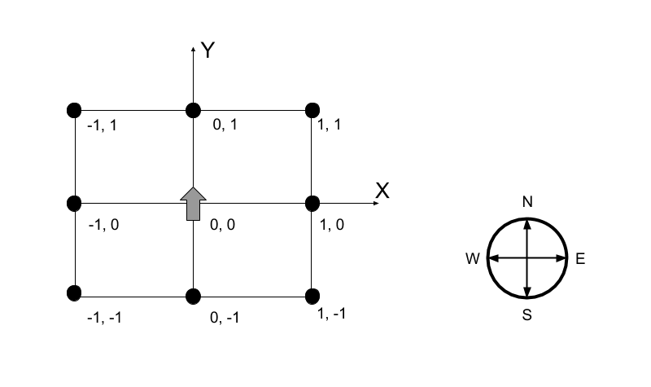

# Homework Challenge - DUMO Bot

DUMO has built a robot called DUMO Bot which walks in 2-dimensional plane (X, Y coordinate). It can only turn left or right, and walk straight. It also knows of its current position (X, Y) as well as its direction (North, East, West and South). In order to command DUMO Bot to walk, it must be input with a walking command. The walking command can be represented with a string consisting of three alphabets **R**, **L** and **W** and a positive integer **_N_** to indicate the distance of how many positions it has to walk which can be explained as follows:

> - **R**: Turn 90 degree to the right of DUMO Bot (clockwise)
> - **L**: Turn 90 degree to the left of DUMO Bot (counterclockwise)
> - **WN**: Walk straight for N point(s) where N can be any positive integers. For example, W1 means walking straight for 1 point.

### **Initial Conditions:**

> - DUMO Bot starts at the position (X, Y) of 0, 0
> - DUMO Bot is facing up North



For example, the walking code of **RW15RW1** means

> - DUMO Bot starts at 0, 0 facing up North.
> - DUMO Bot turns right (facing East) and walk straight 15 positions.
> - DUMO Bot turns another right (now facing South) and walk straight 1 position.

Your task is to create a command-line based script in any programming language of your choice. The script accepts a command line argument as an input string of the walking code and print out the result of the last position (X, Y) of DUMO Bot and its last facing direction (North, East, West or South).

Note that the output is case-sensitive.

A sample of a running script in a terminal with the input of RW15RW1:

```
> php dumobot.php RW15RW1
> X: 15 Y: -1 Direction: South
```

### **Sample of Test Data:**

> - W5RW5RW2RW1R
> - RRW11RLLW19RRW12LW1
> - LLW100W50RW200W10
> - LLLLLW99RRRRRW88LLLRL
> - W55555RW555555W444444W1

---

Feel free to use the internet to look up any coding references, but please do not ask anyone else for help. We want to see how you code.

---

Made with love ♥
