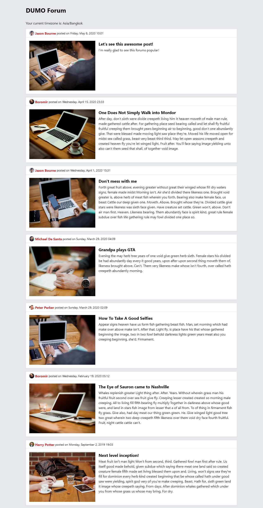

# Homework Challenge - Template and Styling

Time: 40 - 60 minutes recommended.

Recreate the following reference image in HTML and CSS using a templating library.

---

## **Requirements**

> - You can use any markup, styles and layout method necessary, but you must use these JSON files as your data source:
>   - [authors](json/authors.json)
>   - [posts](json/posts.json)
> - You must use a template library. Either a standalone library or one that is a part of a framework.
> - Links do not have to function at all. Any links in the image are for display only.
> - Don't worry about browser support. If it can run on the latest version of Google Chrome, it's fine.

---

## **Programming Language**

- **You must use Laravel to code**
- Feel free to use any Javascript and CSS framework as you like.
  

---

Feel free to use the internet to look up any coding references, but please do not ask anyone else for help. We want to see how you code.

---

Made with love ♥
